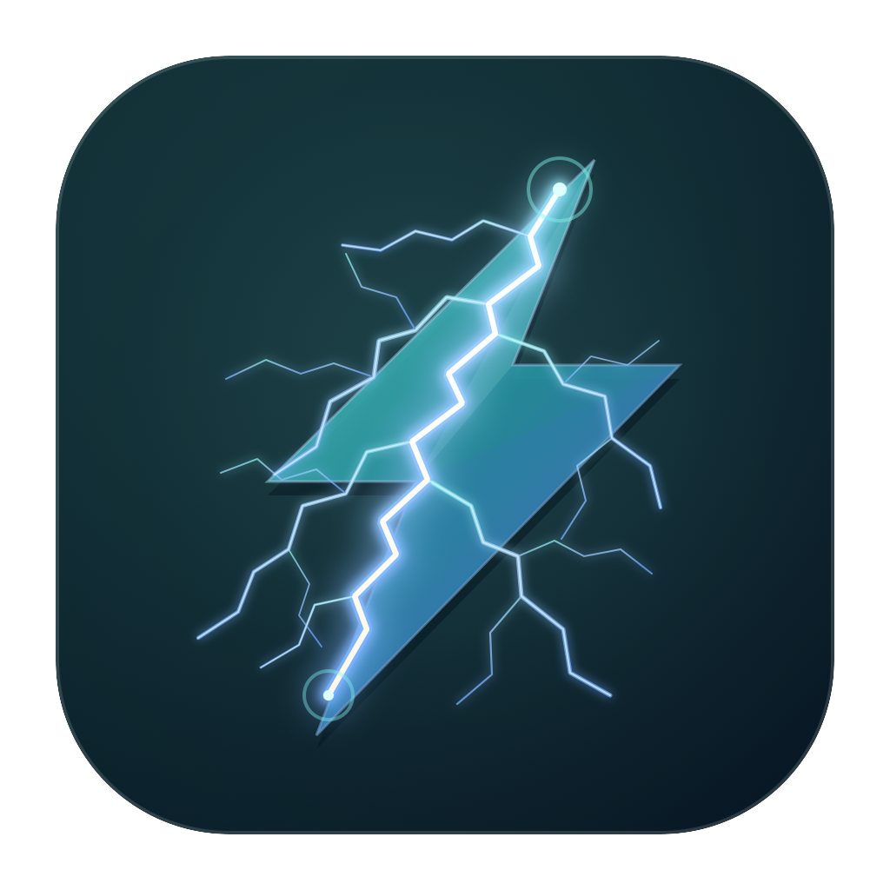
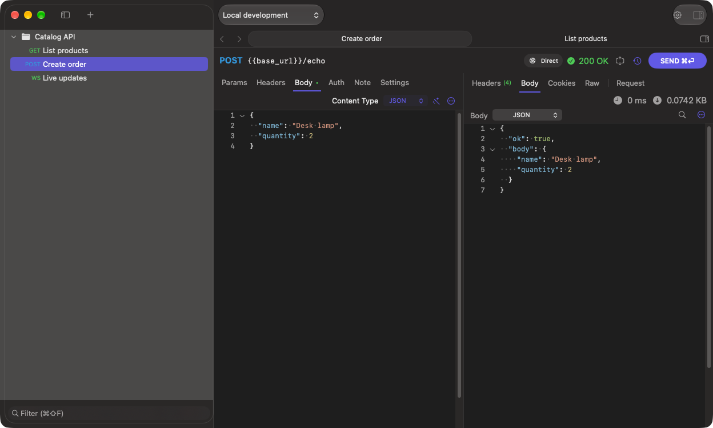
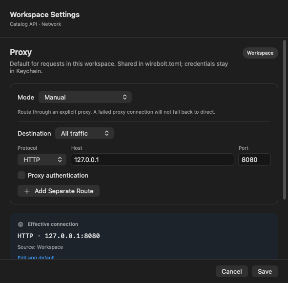

<p align="center">
  
</p>

<h1 align="center">Wirebolt</h1>
<p align="center"><strong>A blazing-fast API client, built natively for macOS.</strong></p>
<p align="center">Rust-powered. Local-first. Zero telemetry. Zero accounts.</p>
<p align="center">Free and open source.</p>

<p align="center">
  <a href="https://github.com/Christopher96u/homebrew-tap/releases"></a>
  
  <a href="LICENSE"></a>
  
  <a href="https://github.com/Christopher96u/wirebolt/actions/workflows/ci.yml"></a>
</p>

<p align="center">
  <a href="https://github.com/Christopher96u/homebrew-tap/releases">Download beta</a> ·
  <a href="docs/quick-start.md">Quick start</a> ·
  <a href="docs/README.md">Documentation</a> ·
  <a href="https://github.com/Christopher96u/wirebolt/issues/new/choose">Report a bug</a>
</p>



Built for speed, from switching tabs to inspecting large responses. Wirebolt pairs a native SwiftUI/AppKit interface with a Rust core, streams response bodies to disk, and renders only the visible portion of large responses. [Performance budgets are enforced by automated checks](docs/development.md#performance).

Send HTTP requests, connect to WebSockets, and keep your API work in readable local files. No account. No telemetry. Share through Git when you choose.

> **Beta:** this documentation describes the current source on `main`. Published beta builds can lag behind it. See the [changelog](CHANGELOG.md) for unreleased work and [installation](docs/installation.md) for supported hardware and first-launch instructions.

## Install

Requires **Apple Silicon and macOS 15 or later**.

```sh
brew install --cask Christopher96u/tap/wirebolt
```

Or download the ZIP from [beta releases](https://github.com/Christopher96u/homebrew-tap/releases), extract it, and move Wirebolt to Applications. Current beta packages are ad-hoc signed, not notarized; see [first launch](docs/installation.md#first-launch) if macOS blocks opening the app.

## Your first request

1. Open Wirebolt and choose **File → New Workspace…**.
2. Press **⌘N** (**File → New Request**) or click **New Request** in the empty window.
3. Enter your API URL, choose a method, and press **⌘Return** to send.
4. Inspect the response and press **⌘S** to save the request.

The [quick start](docs/quick-start.md) includes a local demo server and copyable requests, so you can try Wirebolt without an account or API key.

## What you can do

| Feature | What it gives you |
| --- | --- |
| [HTTP requests](docs/requests.md) | Methods, query parameters, headers, JSON, forms, multipart and file uploads |
| [Response inspection](docs/requests.md#inspect-the-response) | JSON, tree, raw, XML, HTML, image and hex views; headers, cookies and the executed request |
| [Workspaces](docs/workspaces.md) | Collections, folders, drag or keyboard ordering with undo, preview tabs and split editors, saved as readable TOML |
| [Environments](docs/environments-and-secrets.md) | Global variables, environment overrides and Keychain secret references |
| [Authentication](docs/authentication.md) | Basic, Bearer, API key and OAuth 2.0 configuration |
| [Proxy and network](docs/proxy-and-network.md) | App, workspace and request proxy policies; timeouts, redirects and TLS validation |
| [WebSockets](docs/websockets.md) | Connect, send text or binary messages, inspect replies and disconnect |
| [Markdown notes](docs/notes.md) | Request documentation with local Edit/Preview modes |
| [Git collaboration](docs/git-collaboration.md) | Review status and explicitly commit, pull or push workspace documents |
| [Import and export](docs/import-export.md) | cURL, HAR, Postman v2 and Wirebolt JSON import; Wirebolt JSON export |

### Configure once, reuse across requests


Use `{{base_url}}` in your requests and switch environments without rewriting URLs. [Set up environments →](docs/environments-and-secrets.md)

### Choose how each request connects



Inherit a default, use the system proxy, connect directly, or configure a manual route. [Understand proxy precedence →](docs/proxy-and-network.md)

### Keep documentation beside the request


Notes are saved with the request. Preview renders locally when opened and does not fetch remote images. [Write request notes →](docs/notes.md)

## Local by design

Wirebolt does not collect telemetry or automatically upload diagnostics. Workspace files contain saved request definitions and environments. Responses, history and credentials are local runtime data. Use Keychain-backed fields for credentials: ordinary text fields and literal variables are stored in workspace files. See [data and secrets](docs/environments-and-secrets.md#what-is-shared).

Git operations run only when requested. There is no background cloud sync and no Wirebolt account to create.

## Beta limitations

- Packages currently target Apple Silicon; Intel, Windows and Linux packages are not provided.
- API key secret provisioning requires Keychain Access; there is no general secret manager in the app yet.
- Wirebolt JSON preserves advanced authentication through extensions that other clients may not understand.
- Markdown images display alternative text; previews do not execute HTML.
- Proxy host exclusions are not exposed in the UI.

See [troubleshooting](docs/troubleshooting.md) for setup and compatibility details. Local performance checks are part of development; see [how to reproduce them](docs/development.md#performance) rather than treating a single machine's timings as a guarantee.

## Contribute

Read [CONTRIBUTING.md](CONTRIBUTING.md) to report an issue, improve the documentation or work on the app. Build instructions and checks live in the [development guide](docs/development.md). Security reporting guidance is in [SECURITY.md](SECURITY.md).

## License

Wirebolt is free and open source under the [MIT License](LICENSE). Third-party dependencies retain their respective licenses; beta packages include dependency notices.
