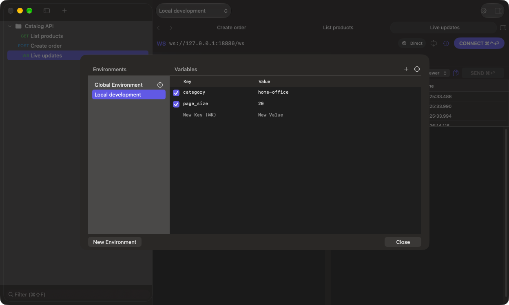

# Environments and secrets

[Documentation](README.md)

## Create variables

1. Open the environment menu in the toolbar and choose **Configure Environments…**.
2. Select **Global Environment**, or create a named environment with **New Environment**.
3. Add a key and value. Keep the row checked to enable it. Click the lock button to make the value a secret.
4. Click **Save** (or press Return). **Cancel** (Esc) discards your edits, including deleted environments, after confirmation.
5. Select the desired environment in the toolbar.



Use variables in request fields with double braces:

```text
{{base_url}}/products?category={{category}}
```

Global variables apply across environments. The selected environment overrides matching Global keys. A disabled row is omitted from resolution. If a variable fails to resolve, check spelling, enabled state and the selected environment before sending again.

Selecting an environment in the editor chooses what you edit; selecting it in the main toolbar chooses what requests use.

## Credentials and secret references

A literal value is stored in the workspace. A secret reference stores a name whose value resolves from this Mac's Keychain. A teammate receives the reference name, not its credential value.

### Secret variables

In **Configure Environments…**, click a variable's lock button (or choose **Make Secret** from its context menu) to store its value in Keychain:

- The value field is masked; use the eye button to show it.
- **Save** writes the value to Keychain and saves only the reference in the environment file. **Cancel** discards it.
- Requests use a secret variable like any other: `{{token}}`. Headers and bodies that use it are redacted in the sent-request view.
- Click the lock again (**Store in Workspace File**) to turn it back into a literal; the value is then saved in the environment file.

Each secret variable has its own Keychain item, so renaming the key keeps its value. A teammate who pulls the workspace sees the variable with an empty value and enters their own. Removing a secret variable or its environment deletes the Keychain item when you open another workspace, a pull reloads the workspace, or you quit; references you typed yourself, such as proxy credentials, are never deleted, and neither are items another workspace in **File → Open Recent** still references.

Basic, Bearer and API Key authentication fields and OAuth client secrets also store their values in Keychain, and OAuth stores acquired tokens there. Proxy credentials are also local. See [authentication](authentication.md) for exact controls.

Items use the Keychain service `io.github.christopher96u.wirebolt`. Approve access for Wirebolt when macOS asks.

## What is shared

| Data | Workspace / export |
| --- | --- |
| Saved URLs, parameters, headers, bodies, notes | Included |
| Literal environment values | Included |
| Secret-reference names | Included |
| Referenced Keychain credential values, including secret variables | Not resolved into the export |
| Response history and cookies | Not included in the workspace document tree |
| Paths to upload files | Can be included; file bytes are not bundled |

Review literal fields before committing or exporting. Keychain storage cannot protect a credential you put directly in an ordinary URL, note or JSON body.
