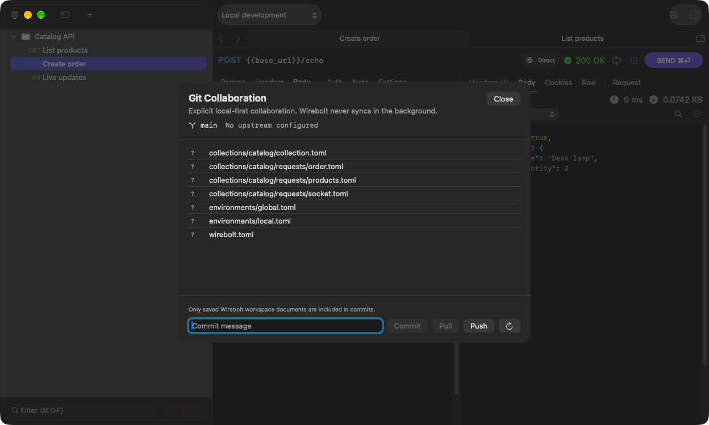

# Git collaboration

[Documentation](README.md)

Wirebolt can show status and explicitly commit, pull or push a workspace. It does not automatically initialize repositories, configure hosting credentials or synchronize in the background.

## Prepare the workspace

Use a dedicated Git repository for the workspace folder. Configure Git identity and authentication using your normal Git tools. For a new repository:

```sh
cd /path/to/your/workspace
git init -b main
git remote add origin <your-repository-url>
```

Replace the path and remote placeholder with your own values. You can also clone an existing workspace repository and open the folder containing `wirebolt.toml`.

## Review and share

1. Save request edits with **⌘S**.
2. Open **Workspace → Git Collaboration…** (**⌃⌘G**).
3. Review the branch, upstream and changed files.
4. Enter a commit message and click **Commit**.
5. Click **Push** when ready to publish to the configured remote. A branch without an upstream shows **Publish**, which pushes it to `origin` and tracks it. Push is disabled, with the reason in its tooltip, when there is nothing to push.



Wirebolt commits its managed workspace documents. Unrelated files are not included by that action. Review ordinary literal fields for credentials before sharing; secret references do not make all user-entered text safe automatically.

## Pull and conflicts

Save or discard request edits before pulling. Pull requires an upstream; first configure a remote and establish tracking, using Git if necessary. A first push can establish an upstream when the remote is configured.

Conflicts are surfaced for explicit resolution. Resolve them using Git and a text editor, then reopen the workspace. Wirebolt does not silently choose a side or automatically resolve conflicts.

Git authentication failures come from your Git/remote setup, which is separate from request authentication and API proxy settings.
