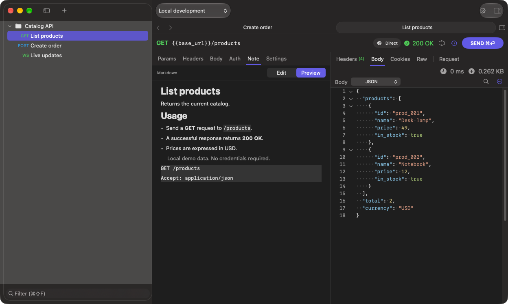

# Markdown notes

[Documentation](README.md)

Open a request's **Note** tab. **Edit** contains the Markdown source; **Preview** renders it. Press **⌘S** to save the note with the request.

````markdown
# List products

Returns the current catalog.

- Use `category` to filter results.
- A successful response returns **200 OK**.

> Local demo data; no credentials required.

```http
GET /products
```
````



Supported formatting includes headings, emphasis, nested lists, quotes, links and fenced code blocks. Image syntax displays alternative text. Preview does not fetch remote resources or execute HTML; it is not a full browser or a promise of every GitHub Markdown extension.

Markdown source is stored in the request TOML `note` field and travels with the saved request. Do not place credentials in notes you intend to share.

Preview parsing runs off the main actor when Preview is visible. Editing does not continuously render Markdown, and hidden notes are not parsed when switching tabs. The preview cache is bounded; unusually large previews can render without being retained in the cache.
