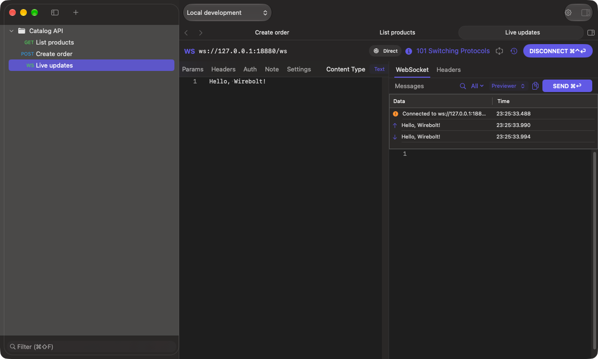

# WebSockets

[Documentation](README.md)

1. Create a **WebSocket** request with **File → New WebSocket Request** or the **+** menu.
2. Enter a `ws://` or `wss://` endpoint.
3. Configure headers, auth, variables and proxy policy as required by that endpoint.
4. Click **Connect** or press **⌃⌘Return**.
5. Select a message representation, enter content and click **Send**.
6. Inspect sent and received messages, then **Disconnect** when finished.

Available message representations include Text, JSON, Binary (Hex/Base64) and File. A binary message must use the selected encoding; a file message requires a readable local file.

Params and Headers support **Request → Bulk Edit** (**⌘B**), as in HTTP requests. Request history and **Copy cURL** apply only to HTTP requests.

The screenshot uses a local echo fixture; the HTTP-only [quick-start server](examples/demo-server.py) does not implement WebSockets. Use your own WebSocket endpoint to follow these steps.

Saving persists the request definition, not an active socket connection. Reconnect after changing proxy, headers, authentication or transport options: the existing connection keeps the configuration used when it opened.

A successful HTTP request to a host does not prove it supports a WebSocket upgrade at the same path. Check the endpoint path, supported scheme and required authentication when connection fails.
